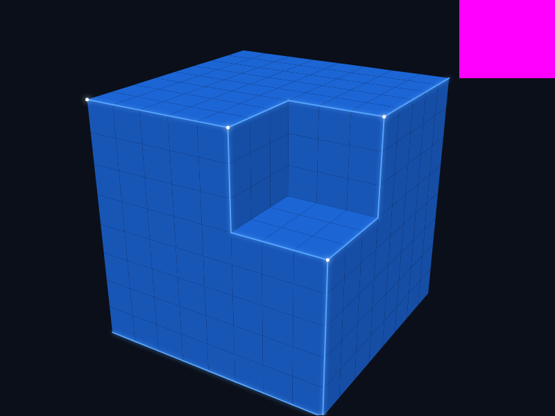
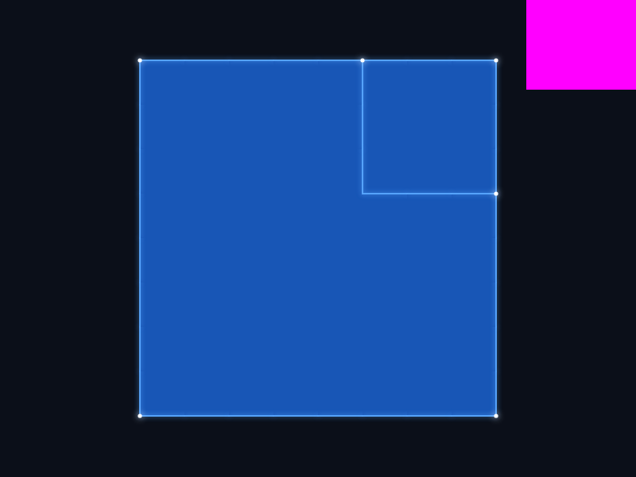

# VoxelPixelThingie

A voxel whose faces, edges, and corners are all addressable, emitting nodes
on a network, and which decides for itself what not to draw.

**Live:** https://skinnerboxentertainment.github.io/VoxelPixelThingie/



The atomic unit is the **VoxelPixelBit**. Each one owns 26 private nodes:
6 faces, 12 edges, 8 vertices. Adjacent bits are joined by explicit links
between touching nodes. Every node can emit color, light, or data. Each bit
tests its own nodes and switches off rendering for anything pressed against
a neighbor, facing away from the camera, or silent. A bit has a stable
identity and an append-only history; the rendering is one expression of it.

Seen straight on, a bit is a pixel with a glowing border. Seen at an angle,
it is an isometric tile. Seen freely, it is a beveled glowing cube.



## Demos

Three renderers, one model, one render list:

- **Canvas 2D reference**: software projection, pixel / tile / cube modes.
  The image every other renderer must match.
- **Three.js WebGPU**: three instanced draws, bloom, free orbit, click to
  carve, frame times in the HUD, 8³ to 32³.
- **PixiJS pixel mode**: pixels that are secretly voxels. Two 16×16 layers,
  a carved pattern showing depth, tile toggle.

## Run

```
npm ci
npm test
npm run dev
```

Node 22 runs the TypeScript directly; there is no build step for the model.
`npm run dev` serves the demos on http://localhost:5173.

Other commands: `npm run typecheck`, `npm run lint`, `npm run test:coverage`,
`npm run test:e2e`, `npm run bench`, `npm run bench:memory`,
`npm run bench:frame` (needs `npm run build && npm run preview` running),
`npm run docs:api`, `npm run scene:export -- <folder> [size]` (write a sealed
scene), `npm run scene:check -- <folder> <url>` (the spime test across stores),
`npm run scene:epcis -- <folder|pack> <out.json>` (a bit's history as an
EPCIS 2.0 document, validated), `npm run scene:epcis:capture -- <out.json>`
(capture it into a local OpenEPCIS and count it back),
`npm run led:drive -- --host <wled ip> --scene <folder|pack> [--dry-run]`
(light a physical bit over DDP, or `--listen` to bridge the Three.js demo
with `?led=http://127.0.0.1:4049&bit=first`),
`npm run job:drive -- <folder> [--bit id] [--kind led-frame|epcis|links]`
(ask a bit for work and watch request, result, audit, and reward land in
its ledger), `npm run scene:sign -- <folder> --key <jwk> --host <host>`
(sign a scene's seal with its container's key),
`npm run mcp -- [--scene <folder>]` (serve the scene over the Model Context
Protocol on stdio: tools to read and change bits and ask them for work,
resources for SPEC sections, ADRs, and the oracle list; `.mcp.json` at the
root points Claude Code at it, and the ledger names the agent as
`mcp:<client>`),
`npm run durable:worker -- --scene <folder>` (host a scene's actors on the
durable engine, a local `temporal server start-dev`; jobs submitted through
`DurableActorPool` survive a killed worker and complete exactly once),
`npm run docker:worker -- --scene <folder>` (the same worker as a Docker
container over a mounted scene folder, with the engine as a container
beside it; `npm run docker:worker -- --down` stops them;
`VPB_DOCKER=1 npm run test:docker` runs the kill-and-restart oracle
through Docker),
`node --experimental-strip-types scripts/wled-sim.ts` (the physical bit's
digital twin: a WLED emulator in the terminal, UDP 4048 and a JSON API on
8790, so the driver runs with no hardware: pass `--http-port 8790` to `led:drive`; invoked directly because
`npm run` under cmd.exe asks before honoring Ctrl-C).
A published scene lives at
[VoxelPixelThingie-scenes](https://github.com/skinnerboxentertainment/VoxelPixelThingie-scenes).

## Read

- [SPEC.md](SPEC.md): the model. Nodes, links, slot numbering, self-culling,
  identity and history, passport, persistence.
- [RESEARCH.md](RESEARCH.md): thirteen ways to render it, from Canvas to
  Unreal, and the 2D / 2.5D / 3D matrix.
- [REPOS.md](REPOS.md): libraries worth integrating or borrowing from.
- [PLAN.md](PLAN.md): the stand-up and demo plan, with the demo script.
- [PLAN-2.md](PLAN-2.md): the second program: flat-array store, fast browser
  persistence, EPCIS export, and the physical bit.
- [PLAN-3.md](PLAN-3.md): the third program, draft: identity with recourse,
  work as audited events, local compute, the scene as an MCP server, one
  durable backend.
- [docs/spime-research.md](docs/spime-research.md): the spime framing
  checked against its source and against the standards that made it real,
  with the v0.4 amendments it implies.
- [docs/research/](docs/research/): field surveys before a track is planned;
  first, attaching compute and storage to a bit.
- [docs/adr/](docs/adr/): why the decisions were made.
- [docs/journal/](docs/journal/): what happened each phase, with the
  numbers.
- [CONTRIBUTING.md](CONTRIBUTING.md): how a change gets in.

## Numbers that matter

From the journals, this machine, one run each:

| What | Value |
|------|-------|
| Solid 8×8×8 | 512 bits, 216 asleep, 384 faces exposed |
| Memory | 254 bytes per bit at 64³ on the default container; the reference container is 15.8 KB per bit |
| Camera move, 32³, awake bits only | 0.57 ms median; 3.4 ms at 64³ |
| Three.js 32³ orbit with bloom, WebGPU | vsync-locked at 60 Hz, model pass 3.0 ms |
| Straight-down view | exactly 9 of 26 nodes per bit |
